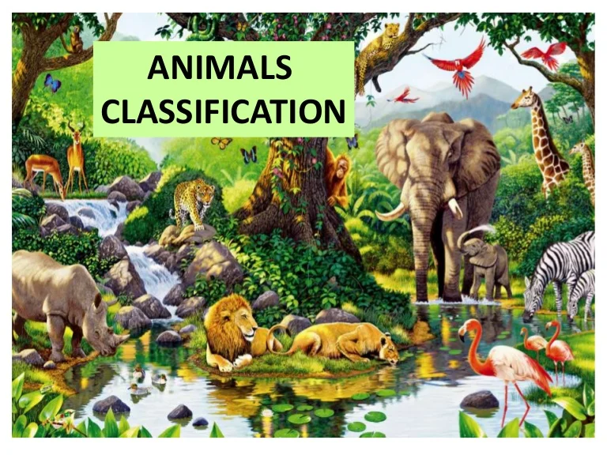

# Cat/Dog Image Classification using CNN 🐱🐶  
 *<!-- Replace with your actual header image -->*

## 📌 Project Overview  
This project implements a **Convolutional Neural Network (CNN)** to classify images of cats and dogs. The pipeline includes **data preparation, CNN modeling, performance evaluation, and deployment as a web app using Streamlit**. The model predicts between two classes:  
🔴 **Cat** | 🟢 **Dog**  

---

## 📊 Data Processing Pipeline  
### **1️⃣ Data Collection**  
- Dataset sourced from Kaggle Dogs vs Cats (25,000 labeled images)

### **2️⃣ Data Exploration**  
- Analyzing class distribution (12,500 images per class)  
- Visualizing sample images from both classes  

### **3️⃣ Data Preprocessing**  
- **Resizing**: Standardizing images to 64x64 pixels  
- **Normalization**: Scaling pixel values (0-255 → 0-1)  
- **Augmentation** (Training Only):  
  - Random flips  
  - Rotation variations  
  - Zoom adjustments  

### **4️⃣ Feature Engineering**  
- **Image to Array Conversion**: Transforming pixels to numerical tensors  
- **Batch Processing**: Efficient data loading for model training  

---

## 🧠 CNN Model Architecture  
```mermaid
graph TD
    A[Input 64x64x3] --> B[Conv2D 32@3x3]
    B --> C[ReLU]
    C --> D[MaxPool 2x2]
    D --> E[Conv2D 32@3x3]
    E --> F[ReLU]
    F --> G[MaxPool 2x2]
    G --> H[Flatten]
    H --> I[Dense 128]
    I --> J[ReLU]
    J --> K[Dense 1]
    K --> L[Sigmoid]
